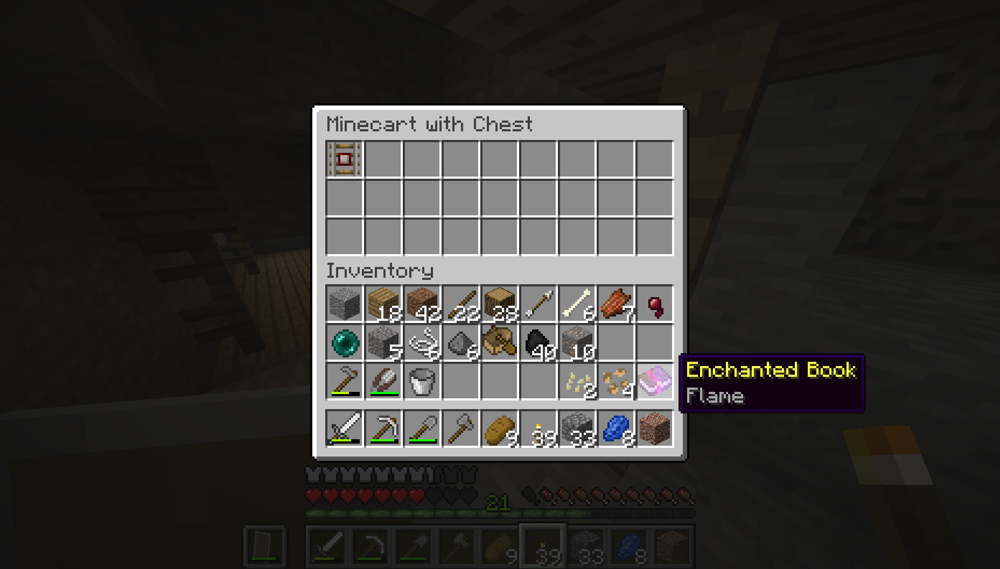

# Ultimate Vanilla Survival

## Day 0
After wandering a few hundred blocks form spawn I've found this cool cliff. I'm thinking
I'll build a cool fortress here one day. For now, I'll need to set up shelter.

## Day 1
One night has passed so far. I've made this small home just inside a cave.

While mining some iron further down in the, I found a mineshaft.

## Day 17
For the last while I've been working on building an actual house to live in. It seems a bit
flat though, so I'll need to spend some time working on the design.

Around back, I've been growing some food and building materials.

## Day 18
Found this ravine a few days ago. I mined out a lot of the iron and got suited up.
Now to find some diamonds.

And then, while mining some coal, I found 6 diamonds, enough for a diamond pickaxe.

## Day 19
I grabbed a shield and decided to go back and explore the mineshaft to try and find
a saddle or whatever other loot there might be.

No saddle in this chest, but I did get a Flame enchantment.

Just fell in the ravine. That could have gone much worse...

## Day 30
I finally made it to the nether and spent the last few days looking for a fortress with
no luck. I think maybe I'll just go back to working on my house.

## Day 31
Finished up my house.

## Day 38
After a couple hours exploring the nether I finally found a nether fortress. Still no saddles
found in the chests. I'll come back some other time to get blaze rods. I forgot to take
a picture for the log. I'll get one next time I go back.

## Day 42
Started building the bridge to the fortress. Hopefully will be able to transform this
cliff into something awesome.

## Day 48
Made some slight changes to the front of the house to make things line up better
and make more space in the main room.

I also set up a sugarcane farm which has been running for a couple days now. It uses
observers and pistons to push sugarcane into a water stream which feeds into a hopper.
The efficiency isn't great but it's automatic.

## Day 50
The fortress is coming along nicely. I'm really enjoying the new basalt blocks.
